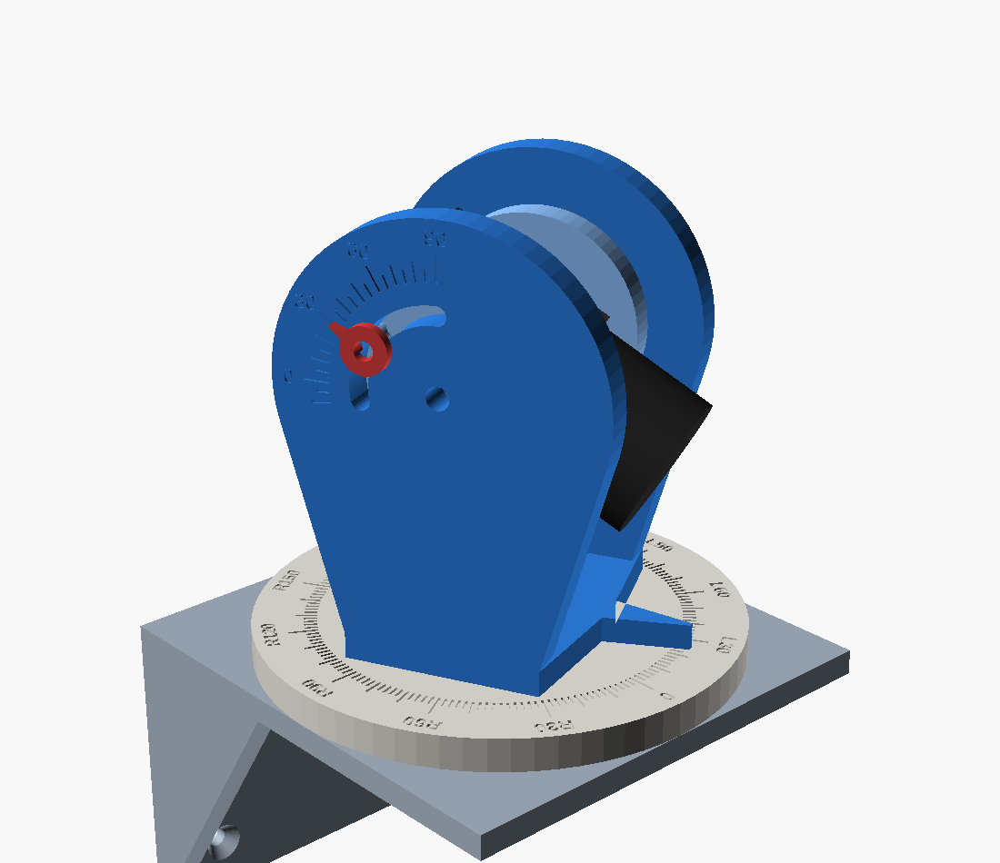

# Printed pan-tilt head for the ED305 cameras

Set a camera's pan and tilt by hand to a number on a scale, and lock it.
Pan scale every 2 deg on the base (L/R from the 0 mark), tilt scale every
5 deg on the right arm (degrees below horizontal). `optimize_cameras.py`
with `configs/mounts_printed.yaml` prints the readings to set ("set scales"
column in `moves.md`).



The tilt axis crosses the pan axis inside the camera body, so turning it is
close to a pure rotation about the camera.

## Before printing: check the camera dimensions

In `pan_tilt.scad`, top section, from the Basler a2A1920-51gc drawing and your lens:
`cam_w`, `cam_h`, `cam_len`, `lens_d`, `lens_len`, and **`cam_m3_holes`
(placeholder: set the real hole positions)**. Or use Basler's tripod adapter
on the 1/4"-20 hole (`tripod_hole = true`). Then re-run the checks below.

## Parts (`stl/`)

| part | qty per camera | print orientation |
|---|---|---|
| `base.stl` | 1 | scale face up |
| `yoke.stl` (wall) / `yoke_ceiling.stl` (ceiling row) | 1 | pan plate on the bed |
| `cradle.stl` | 1 | floor on the bed |
| `washer.stl` | 1 | flat |
| `knob.stl` | 1 | flat, nut pocket up |
| `wall_bracket.stl` | 1 for wall cameras | on its side (gusset face on the bed) |

PETG (holds up next to a warm camera better than PLA), 0.2 mm layers,
4 walls, 40% infill. No supports.

## Hardware per camera

| item | qty |
|---|---|
| M6 x 20 hex bolt + M6 nut (in the knob) | 1 |
| M5 x 16 bolt + M5 heat-set insert (tilt axles) | 2 |
| M4 x 16 thumbscrew + M4 heat-set insert (tilt lock) | 1 |
| M4 x 16 countersunk + nut (base to bracket) | 4 |
| M3 screws for the camera, or 1/4"-20 screw for the tripod adapter | 2 / 1 |
| wall screws + anchors for the bracket | 4 |

## Assembly

1. Heat-set the inserts into the cradle (2x M5 at the axle, 1x M4 on the right cheek).
2. Wall: bracket to the wall, level. M6 bolt up through the base (head in the
   hex pocket), base onto the shelf with the **0 mark pointing straight out from
   the wall**. Ceiling: base straight onto the ceiling, 0 mark toward the door
   (top) wall, and use `yoke_ceiling.stl`.
3. Yoke onto the bolt, knob on top.
4. Camera onto the cradle, housing front on the engraved line; cradle between
   the arms, M5 axles in from both sides.
5. Washer on the M4 thumbscrew, key into the slot, needle pointing away from the axle.
6. Ceiling cameras hang upside down: flip the image in the camera settings
   (ReverseX and ReverseY).

## Setting a camera

1. `python optimize_cameras.py --mounts configs/mounts_printed.yaml ...` -> `moves.md`, column "set scales".
2. Loosen the knob, turn until the pointer is on the pan reading (e.g. L52), tighten.
3. Loosen the thumbscrew, tilt until the needle is on the tilt reading, tighten.
4. Re-calibrate the camera (WORKFLOW.md, C). The scales get you within about
   1 deg; the calibration gives the exact pose.

Ranges for the optimizer (`configs/mounts_printed.yaml`): tilt -10..90 deg
(slot), pan +-90 deg from the wall normal (wall cameras), +-170 deg (ceiling).
The head itself turns all the way round; the camera cable is the real limit.

## Checks (no collisions)

`part="check"` renders what the moving cradle + camera shares with the yoke and
knob at `check_tilt`; `part="check_wall"` the same against the wall bracket at
`check_pan`. Empty = clear. Run after changing any dimension:

```bash
for t in -10 0 30 60 90; do openscad -D 'part="check"' -D check_tilt=$t -o /tmp/c.stl pan_tilt.scad 2>&1 | grep -q empty && echo "tilt $t clear" || echo "tilt $t COLLISION"; done
```

Current design: clear at tilt -10..90 (wall and ceiling), and against the wall
bracket at every pan angle. Not printed or tried on a camera yet.

## Re-export

```bash
for p in base yoke cradle washer knob wall_bracket; do openscad -D "part=\"$p\"" -o stl/$p.stl pan_tilt.scad; done
openscad -D 'part="yoke"' -D ceiling=true -o stl/yoke_ceiling.stl pan_tilt.scad
```
