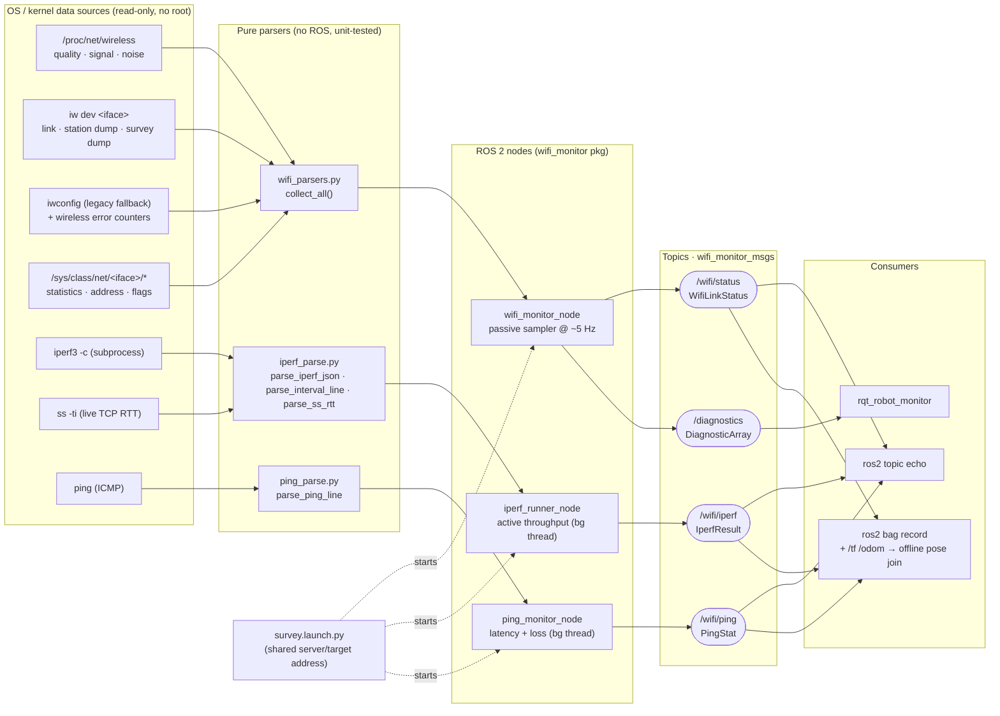

# ros2_wifi_monitor — Block Diagram

Architecture of the Wi‑Fi monitoring stack: three independent ROS 2 nodes,
each wrapping OS/kernel data sources through pure parser modules and publishing
a stamped message. Nodes never depend on one another — a failed source degrades
to `NaN`/`-1` rather than crashing — and `survey.launch.py` starts all three
sharing one server/target address.

## System block diagram

## Node reference

| Node | Reads (via parser) | Publishes | Default rate | Saturates link? |
| ---- | ------------------ | --------- | ------------ | --------------- |
| `wifi_monitor_node` | `/proc/net/wireless`, `iw link/station/survey`, `iwconfig`, `/sys/class/net/*` | `/wifi/status` (`WifiLinkStatus`), `/diagnostics` (`DiagnosticArray`) | 5 Hz | No (passive) |
| `iperf_runner_node` | `iperf3 -c` (+ `ss -ti` for RTT), link carrier for the failsafe | `/wifi/iperf` (`IperfResult`) | ~1 Hz (continuous) / burst | **Yes** — dedicated survey pass |
| `ping_monitor_node` | `ping` (ICMP) | `/wifi/ping` (`PingStat`) | 1/`interval_s` Hz | No (cheap) |

## Data-flow notes

- **Passive vs. active.** `wifi_monitor_node` only *reads* driver/kernel state
  (RSSI, MCS/NSS, retries, counters) and never touches the air. `iperf_runner_node`
  actively *pushes traffic* to measure real throughput, so it saturates the link
  and is meant for a dedicated survey pass. `ping_monitor_node` is the cheap
  middle ground for continuous latency/loss during real operation.
- **Graceful degradation.** Every parser is defensive: a missing tool, sysfs
  file, or denied `iw` sub-command yields absent keys, and the node fills the
  message with `NaN` (floats) / `-1` (ints) instead of failing. `wifi_monitor`
  keeps publishing right through a disconnect (`associated=false`).
- **Failsafes on the active nodes.** `iperf_runner_node` gates on link carrier
  (won't launch a hanging test while disassociated), bounds waits with
  `--connect-timeout`, and backs off on failure. Both `iperf_runner` and
  `ping_monitor` run their subprocess loop in a background thread so the ROS
  executor is never blocked, and both restart the subprocess if it exits.
- **RTT source in continuous iperf.** Continuous mode fills `rtt_ms_*` by
  sampling the *live* iperf connection's kernel TCP RTT via `ss -ti`, so
  throughput and RTT come from one consistent source — which is why the ping
  node is off by default in `survey.launch.py`.
- **Pose mapping.** Every message is stamped, so recording `/wifi/*` alongside
  `/tf` and `/odom` on the robot's local disk lets you time-join link quality
  to position offline.
